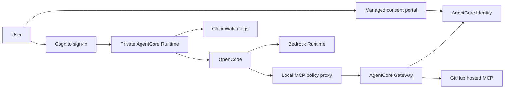
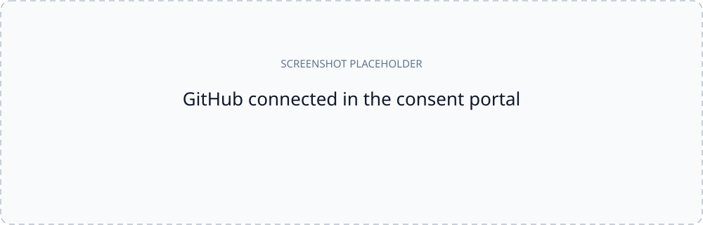
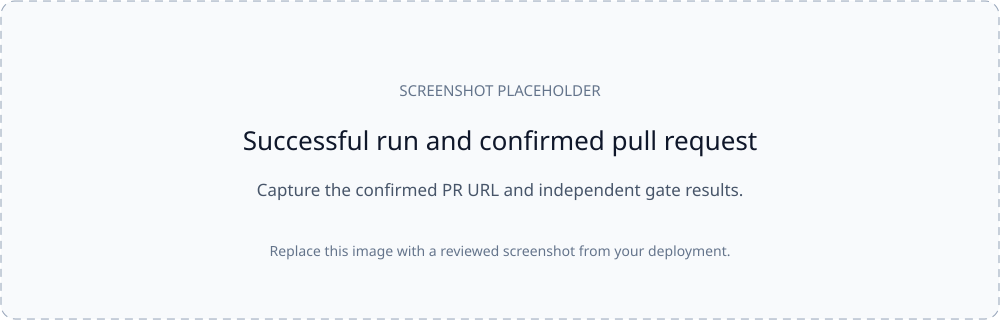
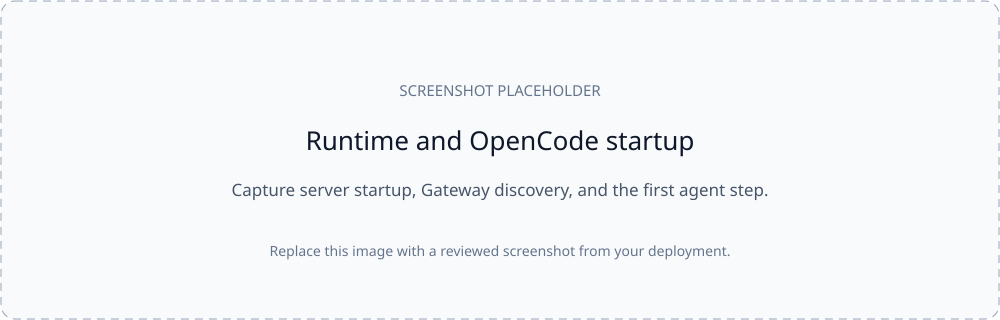
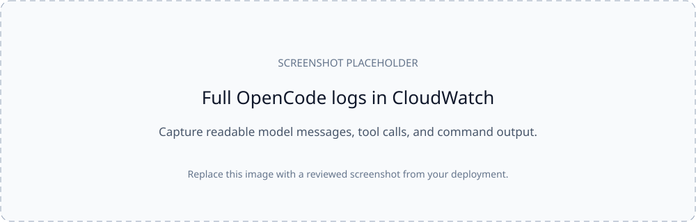

# OpenCode coding harness on AWS AgentCore

Run OpenCode as a headless coding agent in Amazon Bedrock AgentCore Runtime.
The agent uses Bedrock for inference and your GitHub connection to create a
branch, push tested code, and open a pull request.

This example uses **Kimi K3** (`us.moonshotai.kimi-k3`) in **us-east-1**, with a
45-minute budget and a maximum of 180 model steps. It builds a small Go key-value
service from the included [specification](specs/kvstore/SPEC.md). The generated
application goes into a separate GitHub repository.

## How it works



The runtime has no NAT gateway or Internet default route. It reaches Bedrock,
Gateway, ECR, S3, and CloudWatch through VPC endpoints. Gateway calls the hosted
GitHub MCP server using the signed-in user's consent. The caller JWT stays in
the parent harness; OpenCode receives a local MCP URL without that token.

Before publishing, the harness independently runs formatting, vet, race tests,
and at least 80% coverage for both the store and API packages. It checks that
pushed files match the verified workspace. A PR can be created only after a
confirmed push, and completion requires a PR URL confirmed by Gateway.

## Before you start

You need Python 3.10+, Terraform 1.7–1.x, AWS CLI v2, and an AWS account with
permission to provision the resources in this example. Use one AWS CLI profile
for Terraform and all helper scripts. Local Docker is not required: ARM64
CodeBuild builds the image, with OpenCode 2.0.22 and Go 1.27.1 pinned.

You also need access to the selected Bedrock model and a GitHub account that can
create an OAuth App. Initialize a separate target repository with a README so
its default branch exists. Do not use this example's source directory as the
agent's application workspace.

```sh
cd agentcore/harness/opencode
# Optional: export AWS_PROFILE=YOUR_PROFILE
python3 -m unittest discover -s tests -v
python3 -m scripts.preflight --region us-east-1
python3 -m scripts.check_model_access --region us-east-1
```

These AWS checks are read-only. Model catalog discovery alone does not prove
that inference will work; run the model probe below before a coding run.

## 1. Prepare local configuration

All commands below run from `agentcore/harness/opencode`.

```sh
cp terraform/terraform.tfvars.example terraform/terraform.tfvars
terraform -chdir=terraform init
terraform -chdir=terraform fmt -check
terraform -chdir=terraform validate
```

In the ignored `terraform/terraform.tfvars`, set a unique `name_prefix` and
replace `target_repo = null` with your application repository:

```hcl
target_repo = "YOUR_GITHUB_USERNAME/kvstore-demo"
```

Keep the enable flags disabled until their corresponding setup steps. This
example supports the checked private topology in us-east-1; NAT is not
implemented. The Kimi US inference profile can route inference to other US
regions. Terraform derives its model ARNs for the runtime role and endpoint
policy; it does not create an application inference profile.

## 2. Create the GitHub OAuth provider

Follow [GitHub OAuth setup](scripts/connect_github.md) to register an app, supply
its client values locally, and enable `enable_github_identity = true`.
Copy the exact `github_oauth_callback_url` Terraform output into the app's
callback field before authorizing it.

The hosted MCP integration in this example requests the OAuth `repo` scope.
That scope also grants access to private repositories available to the user.
The harness enforces the configured target repository, but GitHub OAuth does
not restrict this grant to that one repository.

**Terraform state and saved plans contain OAuth secrets.** Keep them private;
never upload them or include them in screenshots. The root `.gitignore` excludes
state, plans, local tfvars, token files, and build artifacts.

## 3. Enable the portal and connect GitHub

Set `enable_managed_portal = true` in local tfvars, then apply:

```sh
terraform -chdir=terraform plan
terraform -chdir=terraform apply
python3 -m scripts.set_user_password --user user-a
terraform -chdir=terraform output -raw consent_portal_url
```

The password helper prompts privately. Open the portal URL and sign in as
`user-a`. Then set `enable_github_target = true` and apply again. Return to the
portal, connect GitHub, and approve the app. Wait until the connection shows
**Connected** and the Gateway target is **READY**.

Terraform provides the five tool schemas in `terraform/github-tools.json`, so
this target does not require a separate administrator discovery authorization.
The portal lifecycle uses a small AWS CLI adapter called by Terraform; the
pinned AWS provider does not expose a native consent portal resource. More
callback details are in the [OAuth guide](scripts/connect_github.md).



*Replace this placeholder with the connected provider and target view. Crop out
browser query strings, account identifiers, and unrelated connections.*

## 4. Build and deploy the runtime

Set `enable_harness = true`, leave `runtime_image_uri = null`, and apply to
create the private network, ECR repository, and CodeBuild project:

```sh
terraform -chdir=terraform plan
terraform -chdir=terraform apply
./scripts/build_image.sh
cat build/image-uri.txt
```

Set `runtime_image_uri` in local tfvars to that immutable digest URI and apply
again. The source archive uses an explicit file list; local configuration,
state, tokens, and logs are excluded. Wait for the runtime and its `demo`
endpoint to become ready.

Keep the same `TF_VAR_github_oauth_client_id` and
`TF_VAR_github_oauth_client_secret` values available for every plan/apply/destroy.
They are not passed to the build or runtime.

## 5. Verify connectivity and run the demo

Sign in as the same Cognito user that connected GitHub in the portal:

```sh
python3 -m scripts.login
python3 -m scripts.invoke --mode probe
python3 -m scripts.invoke --mode model_probe
python3 -m scripts.verify.github --expected-login YOUR_GITHUB_USERNAME
# Run only after the model probe returns BEDROCK_OK and GitHub read passes:
python3 -m scripts.invoke --mode run
```

Login saves an ignored mode-0600 file at `build/user-a.jwt`. It lasts one hour;
refresh it before a long run. `probe` checks the private environment and Gateway
discovery. `model_probe` runs one OpenCode model step without writing files.
`run` generates the Go service, tests it, pushes one commit, and opens a PR.
Use the confirmed `pr_url` in the final summary to review the result. A process
that ends without a confirmed PR reports `run_incomplete`.

Pressing Ctrl+C in the invocation helper asks AgentCore to stop that runtime
session. Each invocation gets a fresh workspace, HOME, and OpenCode state.



*Replace with a successful summary and PR link. Do not show token files or
unredacted authorization URLs.*

## 6. View OpenCode logs in CloudWatch

After runtime creation, set `manage_runtime_logs = true` and apply once its
service-created DEFAULT/demo log groups exist. This imports the groups and sets
retention. Native Terraform resources also enable application and usage log
delivery. Default retention is seven days.

For full agent output, select this log group in us-east-1:

```text
/aws/bedrock-agentcore/runtimes/<runtime-id>-demo
```

OpenCode runs with `--format json`, so the interactive welcome banner is absent.
For a startup screenshot, use the harness `server_started` and
`invocation_started` records, plus the first `step_start` event. In Logs Insights:

```text
fields @timestamp, event, run_id, mode, engine, opencode_type
| filter event in ["server_started", "invocation_started", "gateway_discovered", "opencode_event"]
| sort @timestamp asc
```



For readable model messages and command output, use:

```text
fields @timestamp, run_id, opencode_type, data.part.text as agent_text,
       data.part.tool as tool, data.part.state.output as command_output
| filter event = "opencode_event"
| filter run_id = "YOUR_RUN_ID"
| sort @timestamp asc
```

Expand a row or its `@message` when you need full tool inputs and results.
Long events are split into `event_id`, `chunk_index`, `chunk_count`, and
`chunk_data`; concatenate chunks in index order to reconstruct the event.
Delivery can take a few minutes. Generate fresh logs with `model_probe` if a
new log stream is empty.



Logs redact known credential formats and structured credential fields, but they
include specifications and generated code. Review every screenshot locally
before publishing it. Separate service metadata/usage groups live under
`/aws/vendedlogs/bedrock-agentcore/runtime/`; Gateway diagnostics live under
`/aws/vendedlogs/bedrock-agentcore/gateway/`. These are not the full CLI log stream.
See the [screenshot checklist](docs/screenshots/README.md).

## Code organization

| Area | Responsibility |
| --- | --- |
| `harness/app.py` | HTTP validation and streamed responses |
| `harness/config.py` | Validated settings, requests, and results |
| `harness/runner.py` | Coordinates one invocation |
| `harness/workspace.py`, `process.py` | Private workspace and process cleanup |
| `harness/gateway_client.py` | MCP handshake, discovery, and session state |
| `harness/gateway_proxy.py`, `gates.py` | Repository policy and independent pre-push checks |
| `harness/opencode_config.py`, `events.py` | OpenCode configuration and redacted event delivery |
| `harness/tasks.py` | Trusted task instructions, permissions, deliverables, and gates |
| `scripts/common.py` | Shared AWS, Terraform output, token-file, and evidence helpers |
| `terraform/` | Networking, identity, Gateway, runtime, build, and logs |
| `specs/kvstore/`, `tests/` | Demo task and harness contract tests |

An operator can define another trusted `TaskDefinition` and wire it into request
parsing and execution. Caller-supplied task text cannot change shell permissions,
file rules, or publishing policy. Legacy `python3 scripts/...` entry points also
work; the module commands above are preferred.

## Verification and limits

The public example has 39 local tests, including a fresh-checkout diagnostic test. A previous deployment completed the full Kimi
demo in 510.2 seconds over 33 model steps, with store coverage of 98.5%, API
coverage of 97.8%, and all 127 OpenCode events matched against CloudWatch.
The refactored runtime passed private Bedrock, missing/rogue token, unconsented
GitHub, and log-delivery checks. These results do not certify a new deployment.

```sh
python3 -m unittest discover -s tests -v
python3 -m scripts.verify.secret_scan
# Live checks require deployed resources and may create temporary Cognito users:
python3 -m scripts.verify.network
python3 -m scripts.verify.identity --model --github
```

The last command invokes paid Bedrock inference and attempts a branch create as
an unconsented diagnostic user; authorization must be required. Diagnostic
reports are written under ignored `docs/evidence/`.

This is a single-account example, not a production deployment. Generated Go
tests execute arbitrary code under the runtime role. File/shell permissions and
the proxy are defense in depth, not a sandbox for hostile code. Complete
cross-session isolation and apply–demo–destroy testing remain outstanding.
See [security boundaries](docs/threat-model.md).

## Cost and cleanup

Charges include VPC endpoint hours in two AZs, CodeBuild, ECR/S3 storage,
CloudWatch, AgentCore Runtime, and Bedrock inference. Endpoints keep accruing
charges while idle. Review the resources and destroy the example when finished:

```sh
./scripts/destroy.sh
```

The helper creates a private saved destroy plan and requires you to type
`destroy` before applying it. Cleanup deletes built images and source archives.
Revoke the OAuth App's GitHub authorization separately. If AWS retains service
ENIs temporarily, inspect the helper's report and retry after release; do not
manually detach service-managed ENIs.
