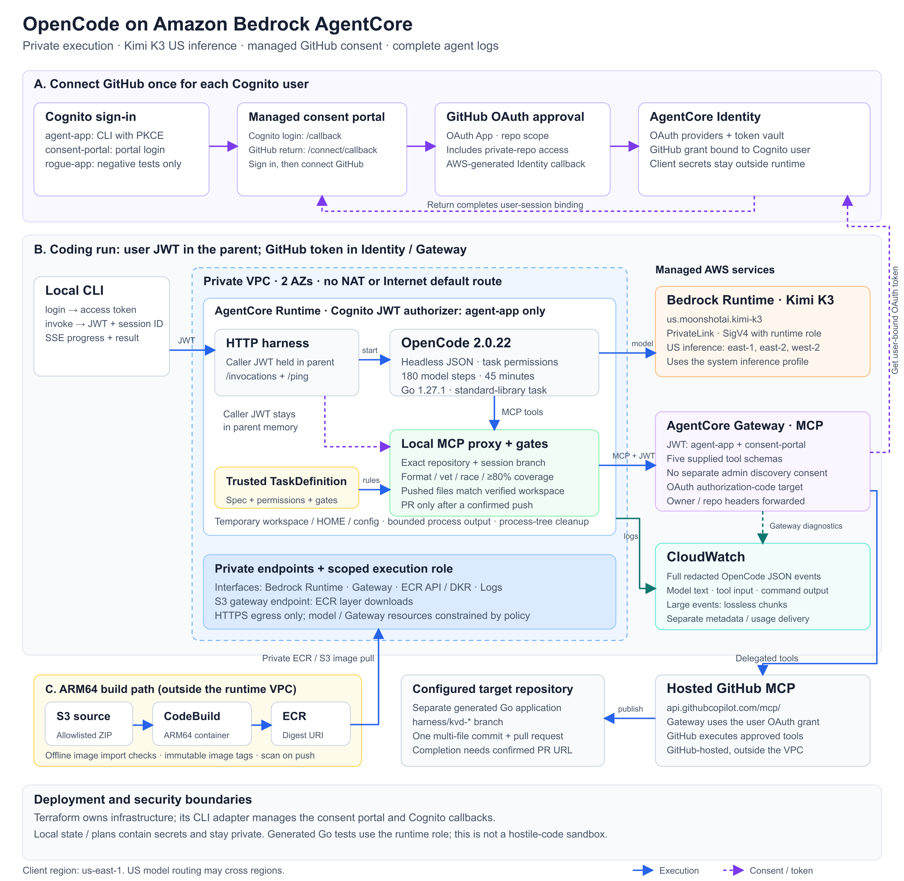

# Architecture

[View the SVG](architecture.svg) for full-resolution text. The diagram is a
logical view of the implementation; managed services are outside the runtime
VPC. Public inbound authorization and private outbound networking are separate
controls.

## Consent and identity

Each user signs in to the managed AgentCore consent portal with Cognito, then
approves the GitHub OAuth App. AgentCore Identity stores the user-bound grant
and OAuth provider credentials. GitHub's `repo` scope includes private-repository
access; the harness independently enforces the configured repository.

Cognito has separate clients: `agent-app` is a public PKCE client for the CLI,
`consent-portal` is the confidential portal client, and `rogue-app` exists for
negative tests. The portal's Cognito login uses `/callback`; the GitHub consent
return uses `/connect/callback`. The GitHub OAuth App itself uses the exact
AWS-generated Identity callback. Terraform supplies Gateway target schemas,
so this example does not need separate administrator discovery authorization.

## Coding invocation

1. The local CLI sends a Cognito access token and runtime session ID to the
   `demo` endpoint. Runtime admits `agent-app` only and forwards the allowed
   Authorization header to the HTTP harness.
2. The parent harness checks its environment, discovers approved Gateway tools,
   and verifies repository read access before starting a coding run. It creates
   a temporary workspace, HOME, and OpenCode configuration.
3. OpenCode uses the Bedrock provider with the runtime execution role. The
   selected system profile is `us.moonshotai.kimi-k3`; no application inference
   profile or model API key is created. Requests enter through the us-east-1
   Bedrock Runtime endpoint; model inference may route to us-east-2 or us-west-2.
4. The worker calls a loopback MCP proxy without a caller token in its config.
   The parent forwards its held JWT to Gateway. Gateway admits the trusted
   agent/portal clients and uses Identity to obtain that user's GitHub token.
   GitHub credentials are not returned to OpenCode.
5. The proxy checks the exact repository and session branch. Before the single
   push, it checks deliverables and file content, then independently runs
   formatting, vet, race tests, and >=80% coverage for both store and API. A PR
   is allowed after a confirmed push; success requires a Gateway-confirmed PR URL.
6. The HTTP harness streams redacted JSON events to the CLI and CloudWatch.
   Large events are chunked without truncation. Temporary files and child
   processes are cleaned up when execution ends. Default limits are 180 model
   steps and 2700 seconds, with extra runtime lifetime for cleanup.

## Private network and build

The us-east-1 VPC uses two private subnets, with no NAT gateway, Internet gateway,
or Internet default route. Runtime HTTPS egress is limited to interface endpoints
for Bedrock Runtime, Gateway, ECR API/DKR, and Logs, plus the S3 gateway endpoint
used for ECR image layers. Scoped IAM and endpoint policies constrain calls.
Gateway's hosted GitHub connection is outside the runtime VPC.

The build helper uploads only allowlisted source to S3. ARM64 CodeBuild builds
and checks the image, then pushes it to a private ECR repository with immutable
tags and scanning enabled. Runtime uses an immutable digest URI and pulls via
ECR/S3 endpoints. The build environment can download tools; the coding runtime
has no public Internet route.

Terraform owns networking, roles, identity providers, Cognito, Gateway, runtime,
build resources, and log delivery. Its small CLI adapter covers the managed
consent portal and Cognito callback reconciliation for the pinned provider gap.
Local state/plans contain secrets and are not public artifacts.

## Logs and limits

The runtime stdout group contains full redacted OpenCode events: model text,
tool inputs, outputs, and errors. Separate native delivery resources send
application metadata, usage data, and Gateway diagnostics to CloudWatch. Logs
may still contain specifications and generated code.

The loopback proxy and agent permissions do not sandbox malicious generated Go
tests. Generated code runs with the runtime role; IAM and networking remain
necessary. Complete cross-user write isolation, session isolation, and a clean
deployment/destroy lifecycle still need broader verification. See the
[security boundaries](threat-model.md).

## Source map

| Component | Implementation |
| --- | --- |
| HTTP and invocation lifecycle | [app.py](../harness/app.py), [runner.py](../harness/runner.py), [workspace.py](../harness/workspace.py), [process.py](../harness/process.py) |
| Worker configuration and task contract | [opencode_config.py](../harness/opencode_config.py), [tasks.py](../harness/tasks.py) |
| MCP transport, policy, and publishing checks | [gateway_client.py](../harness/gateway_client.py), [gateway_proxy.py](../harness/gateway_proxy.py), [gates.py](../harness/gates.py) |
| Complete redacted agent events | [events.py](../harness/events.py) |
| VPC endpoints and model resources | [network.tf](../terraform/network.tf), [bedrock.tf](../terraform/bedrock.tf) |
| Consent and tool credentials | [consent_portal.tf](../terraform/consent_portal.tf), [cognito.tf](../terraform/cognito.tf), [identity.tf](../terraform/identity.tf), [gateway.tf](../terraform/gateway.tf) |
| Build, runtime, and logs | [ecr_codebuild.tf](../terraform/ecr_codebuild.tf), [runtime.tf](../terraform/runtime.tf), [logs.tf](../terraform/logs.tf) |
